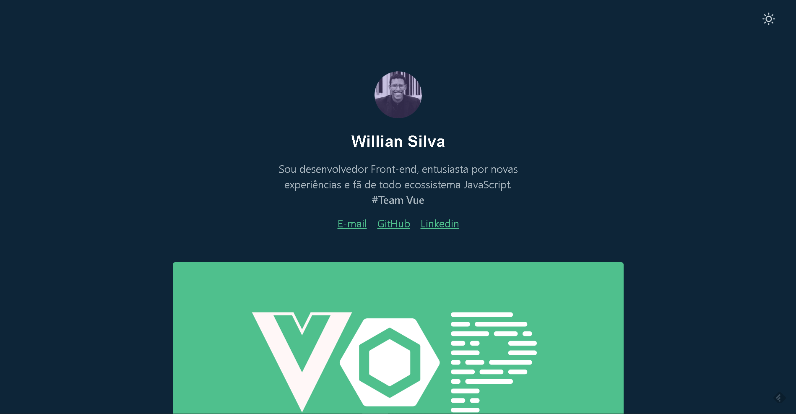

<h1 align="center">Blog Willian Silva</h1>

# Features

Esta aplicação possui todas as ferramentas e práticas mais recentes em desenvolvimento web!

- **Vue.js** — The Progressive JavaScript Framework
- **Gridsome** — Modern Site Generator for Vue.js
- **Tailwind** — A utility-first CSS framework for
rapidly building custom designs.

Made with Vue, Gridsome and Tailwind